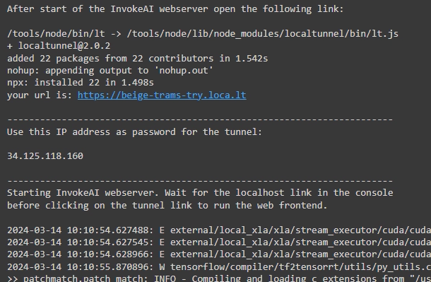
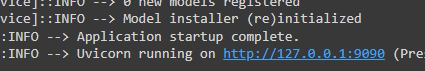
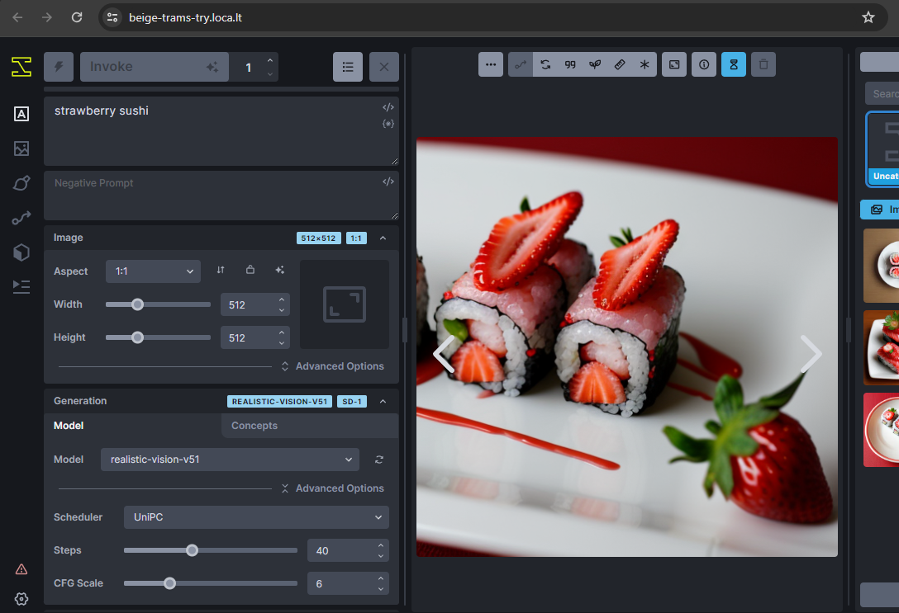
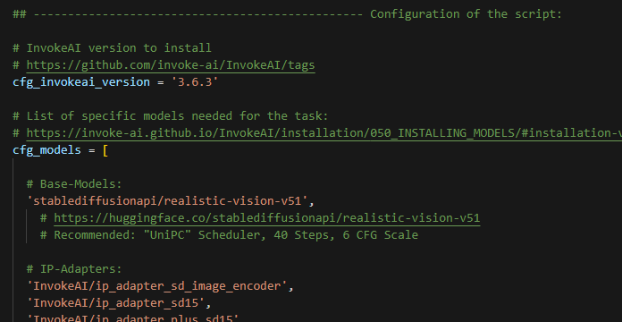

# InvokeAndGo

<ul class="invokeandgo">

<li> This Notebook installs and runs a (temporary) instance of <a href="https://github.com/invoke-ai/InvokeAI" target="_blank">InvokeAI</a> with a single click, accessable through its web frontend, using a photo realistic Stable Diffusion 1.5 model.

<li> It is publically accessable through a <a href="https://theboroer.github.io/localtunnel-www/" target="_blank">Localtunnel</a> in protected cloud environments. 
 At the end of the installation the console shows the link and password: 
  
 After InvokeAI prints out the localhost HTTP address you can open the link to the tunnel and access the installation: 
  
 

<li> You need a runtime with <a href="https://cloud.google.com/compute/docs/gpus" target="_blank">GPU support</a>. As of now the installation even runs on the free-of-charge Google Colab T4 runtime! Installation takes about 10 minutes.

<li> If you want to use a specific version of InvokeAI or a different set of models, just edit the configuration section at the beginning of the code: 
  
 <ul> <li> Since Google Colab does  (for a list of various models) I chose to keep it in pure code. </i> <li> If you want to speed the installation up you can remove the IP-Adapter and ControlNet models and load them as needed using the <a href="https://invoke-ai.github.io/InvokeAI/installation/050_INSTALLING_MODELS/#installation-via-the-web-gui" target="_blank">model manager page</a> of InvokeAI's UI later. </ul>

<li> Run your InvokeAI instance now with this link: 

</ul>